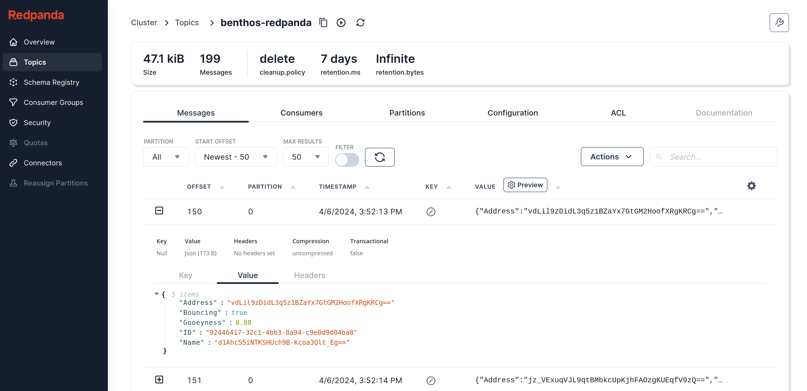

This is a custom processor that takes a list of JSON paths to specific fields in a message along with a key string. The value of each path is then encrypted using the AES encryption standard.

The default output is a Kafka topic on Redpanda, so this repo includes details for starting up a Redpanda instance (and Redpanda Console).

## Overview

Given the following input:

```
input:
  generate:
    interval: 1s
    mapping: |
      root.ID = uuid_v4()
      root.Name = [ "frosty", "spot", "oodles" ].index(random_int() % 3)
      root.Address = "123 Happy St"
      root.Gooeyness = (random_int() % 100) / 100
      root.Bouncing = random_int() % 2 == 0
```

The following `encrypt` pipeline will encrypt the `Name` and `Address` properties:

```
pipeline:
  processors:
    - encrypt:
        fields: [ Name, Address ]
        keyString: 74e8614ce53bf79719974edc22f367d606608e91e40b4fcc58d1d5a9bf219dcb
```

A complete configuration example can be found [here](./config.yaml).

## Prerequisites

The config in this repo creates data, encrypts the data, and then writes it to a topic in Redpanda. A Docker compose file is included which provides an easy way to get Redpanda and Redpanda Console deployed.

Listed below are the app versions used during development (other versions will certainly work but mileage may vary):

- Docker 24.0.7
- Docker Compose 2.21.0
- Golang 1.21.5

> Golang 1.21.5 was used while creating this repo, but other versions will work.

One way to get Golang installed (if you don't already have it) is [gvm](https://github.com/moovweb/gvm). Once installed, use `gvm` to install Golang 1.21.5:

```sh
bash < <(curl -s -S -L https://raw.githubusercontent.com/moovweb/gvm/master/binscripts/gvm-installer)
gvm install go1.21.5
```

> Note: If you use zsh, replace `bash` with `zsh` in the command above.

Now you can switch to this Golang version at any time:

```
gvm use 1.21.5
```

## Usage

The `init.sh` script does two things: 1) properly sets directory permissions on Linux and 2) deletes all Redpanda data in the `redpanda-data` directory:

```sh
./init.sh
```

Start Redpanda and Redpanda Console:

```sh
docker compose -f compose.redpanda-0.yaml -f compose.console.yaml up -d
```

Pull the encrypt component dependencies:

```sh
go get github.com/benthosdev/benthos/v4/public/service
go get github.com/benthosdev/benthos/v4/public/components/all
go get github.com/tidwall/gjson
go get github.com/tidwall/sjson
```

While the [config.yaml](config.yaml) contains a key string, it is recommended to generate your own hex-encoded 32-byte string to use for `keyString`:

```sh
openssl rand -hex 32
```

Copy and paste the output from the above command into `config.yaml` as the new `keyString` value within the encrypt processor. This key string will also need to be used when decrypting this data in the future.

Now start Benthos:

```sh
go run main.go -c config.yaml
```

Data is now being produced via the "generate" input component. The encrypt processor encrypts the `Name` and `Address` fields. Finally the data is then written to Redpanda in the topic `encrypted`.

Open [Redpanda Console](http://localhost:8080/topics/encrypted?p=-1&s=50&o=-1#messages) to view the message, ensuring the fields `Name` and `Address` are encrypted:



## Cleanup

Type Ctrl-C in the terminal to stop Benthos from generating data, then run the following command to bring down the two containers:

```sh
docker compose -f compose.redpanda-0.yaml -f compose.console.yaml down
```

Run the following command to delete the generated data:

```sh
./init.sh
```

